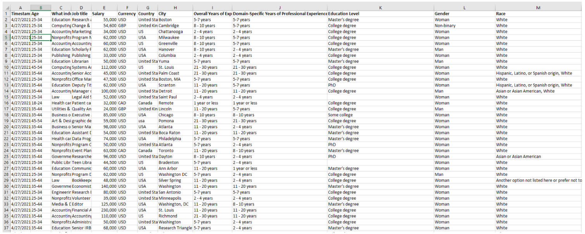
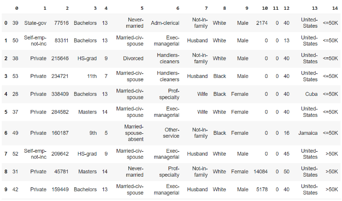

# TEAM INFORMATION (1 point)
Team #: 101
Team Members: 
1. Daniel Avila; davila7.
   Graduated with bachelor's degree in electrical engineering; completed ISYE6501, CSE6040, and MGT8803; studying for OMSA.

2. Alain Daccache; adaccache3. Graduated with bachelor's degree in software engineering; worked as a data scientist for two years, on recommendation engines, marketing analytics, and truck fleet dispatching (operations research). Currently work as an ML Engineer to deploy and scale NLP and CV models in production.

3. Jeffrey Triemer; jtriemer3. Gratudated in 2020 with a Bachelors in Economics from Georgia State University. Worked over a year as a supply chain analyst and then a data engineer. Experienced with data vizualization and python and Alteryx ETL.

4. Bruce Dale Service; bservice3

5. Ethan Goldstein; egoldstein30. Completed a Honours Bachelor of Business Administration at Wilfrid Laurier University. Experienced developing data visualizations/analytics and pipelines/integrations for retailers and local governments, with a foucs on the SQL Server ecosystem. 

# OBJECTIVE/PROBLEM (5 points)
## Project Title: Salary Prediction with Polling Data

### Background Information

In 2022, it was estimated that over 158 million Americans were in some form of employment (reference). While the pandemic affected much of the nature of jobs as well as the supply-demand dynamics of the job market, many Americans spent their time reflecting on their career decisions. Was their choice of education appropriate, or does it matter at all when stacking against those with lower education-level? How about their occupation, distance from office, or age? Are there some statistically significant demographic biases that would prevent them from achieving their desired objectives? 

### Problem Statement

The primary objective of this project is to analyze and forecast job salaries in the context of the evolving employment landscape in the United States, while investigating the underlying drivers that influence salary level. This analysis aims to address the following key questions: 

* How do factors such as occupation and age contribute to variations in job salaries, and is there some discernible demographic biases that affect those salaries? 

* How can we predict an individual's salary based on such attributes so that they have more confidence in their current compensation, if applicable? 

Through a thorough examination of these questions, this project aims to offer a deeper understanding of the intricate factors that influence job salaries, so that individuals can make more informed career choices.  Businesses compensation packages are competitive; business owners would choose the employees that provide the highest value for the money.

### Primary Research Question

How do factors such as occupation and years of experience contribute to variations in job salaries, and is there some discernible demographic bias that affects those salaries? 

### Supporting Research Questions

1. What are the key determinants of job salaries in the United States, and how do these determinants interact with each other? 

2. Are there specific industries or occupations that consistently offer higher salaries?

3. To what extent does an individual's level of education impact their job salary? Are there significant differences in salary between those with varying educational backgrounds? 

4. Is there any unjust bias in the given Salary based on protected classes?

### Business Justification

From an employee perspective, this would allow them to make more informed career decisions, and in turn lead to job satisfaction, career progression, and ultimately a positive impact on the overall economy. 

From a business’s perspective, this would help them understand if their compensation packages are competitive and fair, so that they can better position themselves in their industry. 

Governments could also use this analysis to inform labor policies i.e., minimum wage adjustments, so that the job market could be more equitable, reducing disparities in the economy.  Illegal discrimination can be identified and rooted out, or discover any otherwise unjust DEI infractions to further inform and improve payroll and hiring decisions going forwards.

# DATASET/PLAN FOR DATA (4 points)
### Data Sources and Description

The data sets below show this forecasting as both a classification and regression task. We will be evaluating different models (e.g. logistic regression, linear regression) and identify whether different datasets could lead us to similar conclusions. Since one dataset is more recent than the other, we could also see if some factor importance or interactions changed over time. 

Ask a Manager Salary Survey: In 2021, ALISON GREEN conducted a survey on AskAManager.org, which primarily focuses on the United States but also considers responses from various countries. The survey was created to investigate compensation differences across industries, taking into account factors such as years of experience, field-specific experience, as well as demographic variables like gender, race, and educational background. 

Census Income Dataset (https://archive.ics.uci.edu/dataset/20/census+income) 
The "Census Income" dataset, extracted by Barry Becker on April 30, 1996 from the 1994 Census database, is used for predicting whether a person's income exceeds $50,000 per year based on census data. It is also known as the "Adult dataset. 

### Key Variables

#### Independent variables: 

* Demographic Related: Age Range, Gender, Marital Status, Race, Native Country
* Professional Related: Work Class (private, self-employed, government), Education level (Bachelors, Masters, PhD), Occupation (Farming, Transport, Protective Services, Tech Support, Sales...), Overall Years of Experience, Years of Experience in the Current Domain 

#### Dependent variables: 

* Salary: could be binary (i.e. above or below 50k) or continuous. 

We will likely be creating new variables, including interaction terms in order to capture the relationships between some of our predictors. For instance, age and occupation would give us insights on whether some occupations value or have biases towards age. We will also be creating some dummy variables for our categorical variables i.e. education and age range, effectively creating m – 1 variables for predictors that could take m values. 

Finally, we hypothesize that the most important predictors of our dependent variable, salary, would be certain occupation fields and years of experience. 

# APPROACH/METHODOLOGY (8 points)

### Planned Approach

**Data Preprocessing:** this will involve cleaning the dataset; this might involve specifying the types of the variables (i.e., factor in R for categorical), and cleaning rows that have missing data. For example, factors may be developed for categorical variables and data may be cleaned through an evaluating tradeoff of imputation process. 

**Exploratory Data Analysis:** Involves exploring univariate and bivariate distributions, identifying linear and nonlinear relationships / correlations, and identifying and treating outliers (e.g. evaluating tradeoff imputing, deleting). We will verify assumptions of linear regressions by testing the linearity and homoscedasticity of the data.

**Feature Engineering:** In this step, we will apply some data transformations to account for non-linear relationships, such as heteroscedasticity if identified above; this will be done via Box-Cox transformations including natural log and square root transforms of predictor and/or response variables as we see fit. This will also involve adding some features as mentioned previously, specifically indicator (dummy) variables (for encoding categorical variables) and then interaction terms (i.e. age * occupation).  

**Feature Selection:** Based on correlations found above, we can preliminarily reduce the dimensionality of the dataset. We will likely run a regression model first and let metrics such as the VIF help us determine which features could be removed, and whether it makes sense from a business perspective. This could also involve techniques such as Principal Component Analysis (or PCA). 

**Model Building:** This will involve performing linear regression (e.g. linear, log-linear, linear-log, log-log) as well as logistic regression. Then, we will evaluate the quality of the factors (p-value, confidence interval, t-stat), and overall model; this will involve choosing metrics such R-squared, adjusted R-squared, RMSE, F-score for linear regression, as well as metrics like Precision, Recall, AUC-ROC for our logistic regression.  Based on some diagnostic plots, we could identify whether we meet the assumptions of the model, and otherwise proceed with treatment and reiterate on our data preprocessing, feature engineering and feature selection steps above. 

* Further investigating our non-linear transformations if non-normality of residuals (QQ Plot, Jacque-Berra), heteroscedasticity (found in residuals vs. Fitted), or autocorrelation (found via Durbin-Watson) is found. 

* Further performing feature selection based on VIFs when testing for multicollinearity. 

* Treating high-leverage points if found via Cook’s distances plot. 

**Model Selection:** We will test different linear regression models e.g. linear-log, as well as regularized linear regression models that handle overfitting e.g. Ridge, Lasso, ElasticNet. We will select the best models by performing methods such as cross-validation, which will optimize our hyper-parameters (I.e. alpha, the penalty term for amount of shrinkage, and the classification threshold) w.r.t. to the quality metrics we mentioned previously. Cross-validation will help us prevent overfitting and provide unbiased performance assessments.  

Interpret the Results: We will quantify the impact of variables while keeping others constant, and examine the significance of coefficients i.e. keeping all else constant, and on average, one unit or % increase of one variable could result in how much of an increase / decrease of the response variable (salary). Interpreting indicator variables w.r.t. base case, and same with the interaction terms. 

### Anticipated Conclusions/Hypothesis

Our null hypothesis will be that any protected class information we have in the model, such as age, race, sex, or gender will all have statistically insignificant coefficients. If we find that any such independent variable can be declared as statistically significant for a model built to predict Salary, then we must reject the null hypothesis and we can assert that the data reflects there is a bias is the payroll based on those protected classes.

Rejecting the null hypothesis would reflect that there are major DEI concerns to address within the given dataset. 

### What business decisions will be impacted by the results of your analysis? What could be some benefits?

Hiring and payroll packages can be reassesed to reflect DEI values in a more just way. A linear regression model can not only reflect that some parameter is statistically significant, but give a sense of magnitude and direction. We can use those coefficients to estimate in what ways payroll can be changed to reflect what an individual's Salary would have been had they been another classification of protected class. 

# PROJECT TIMELINE/PLANNING (2 points)

### Project Timeline/Mention key dates you hope to achieve certain milestones by:

##### 10/30 Project Progress Report Deliverables:
- [ ] **Data Preprocessing**
- [ ] **Exploratory Data Analysis**

##### 11/13 Monday before November Break Deliverables:
- [ ] **Feature Engineering** 
- [ ] **Feature Selection**
- [ ] **Model Building**
- [ ] **Model Selection**

##### 11/17 Day before November Break Deliverables:
- [ ] Final Paper First Draft Complete
Followed by a week of revisions

##### 11/27 Final Paper Due
